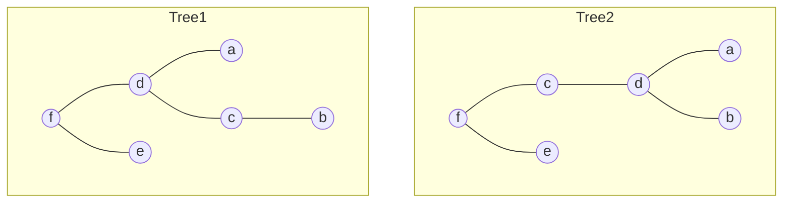

# Tree Edit Distance

This is a Python package for computing the tree edit distance between two trees by Zhang and Shasha (1989).

## Basic Usage

The following two trees are used as an example:



You can compute the tree edit distance between two trees using the `distance` function from the `tree_edit_distance.core` module. Below is an example of how to use it:


```py
from tree_edit_distance.core import Tree, Cost, distance


t1: Tree[str] = Tree("f", [Tree("d", [Tree("a"), Tree("c", [Tree("b")])]), Tree("e")])
t2: Tree[str] = Tree("f", [Tree("c", [Tree("d", [Tree("a"), Tree("b")])]), Tree("e")])

cost = Cost[str].default()

assert distance(t1, t2, cost) == 2
```
